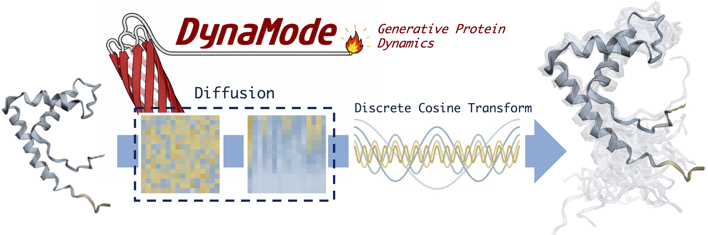

# DynaMode: Generative Protein Dynamics with Spectral Diffusion

[](https://openreview.net/forum?id=0Cy0I8B9O2) 

<p align="center">
  
</p>

Official implementation of [**DynaMode** (Spectral Diffusion for Protein Dynamics)](https://openreview.net/forum?id=0Cy0I8B9O2) accepted at ICML 2026 GenBio workshop. DynaMode is a  diffusion model trained on mdCATH to sample temporally coherent 256 frame (256ns) $C_\alpha$ monomer protein trajectories given an input structure and temperature. Diffusion in the DCT transformed spectral domain over the time domain leads to faster improved dynamics prediction over existing methods.

---

## Installation

```bash
conda env create -f dynamode.yaml
conda activate dynamode
```

## Datasets

2. **mdCATH** — Use script `scripts/download_mdcath.py` to download from [HuggingFace](https://huggingface.co/datasets/compsciencelab/mdCATH) using `hugginface_hub`.
3. **ATLAS** - Use script `scripts/download_atlas.py` to download from [ATLAS](https://www.dsimb.inserm.fr/ATLAS/index.html) using their ftp server.

### OPTIONAL Prepare Zarr Dataset for Fast Training

Using zarr files can immensely increase both stability of training and speed by precomputing 
features into numerical arrays and not relying on maintaining open file streaming of .h5's or
temporary pdb file streams which can cause training.

```bash
python -m scripts.extract_mdcath_features_to_zarr.py --[args]
python -m scripts.extract_atlas_features_to_zarr.py --[args]
```

## Pre-trained Checkpoint

Available soon

## Hydra Configuration

DynaMode uses [Hydra](https://hydra.cc/) configs from `configs/` for both training and inference. The default config is the custom `Spec_Conv` model architecture described in the paper:

- `spec_conv_displacement_ca_unit_var.yaml` - default SpecConv model.
- `transformer_displacement_ca.yaml` - transformer baseline.
- `spec_conv_displacement_ca_shake.yaml` - SpecConv variant with differentiable SHAKE.

Config files are split into sections such as `core`, `data`, `representation`, `model`, `diffusion`, `training`, `sampling`, and `inference`. Override any value from the command line with Hydra dot syntax:

```bash
python -m dynamode.inference \
  --config-name spec_conv_displacement_ca_unit_var \
  inference.input=target.pdb \
  inference.checkpoint_path=checkpoints/best_model.pt
```

The examples below assume commands are run from the repository root with the package installed in editable mode or with `PYTHONPATH=src`.

Training date-prefixes `core.checkpoint_dir` by default; set `date_prefix_checkpoint_dir=false` to use the exact directory you pass.

## Inference

Use `dynamode.inference` to sample trajectories from a trained checkpoint for one PDB, a directory of PDBs, or a glob of PDB paths. Inference exports an aligned `.pdb` first frame and `.xtc` trajectory unless `inference.no_export=true`.

```bash
python -m dynamode.inference \
  --config-name spec_conv_displacement_ca_unit_var \
  inference.input=examples/target.pdb \
  inference.checkpoint_path=checkpoints/specconv/best_model.pt \
  inference.outdir=outputs/inference \
  inference.temperature=300 \
  inference.frames=256 \
  inference.num_ode_steps=50
```

You can also point inference at a training checkpoint directory. If `run_config.yaml` and `best_model.pt` are present, they are used automatically:

```bash
python -m dynamode.inference \
  --config-name spec_conv_displacement_ca_unit_var \
  inference.input=examples/target.pdb \
  inference.checkpoint_dir=checkpoints/specconv_run \
  inference.outdir=outputs/target_300K
```

## Training

Training is launched with `torchrun` because the trainer initializes distributed training even for a single GPU:

```bash
torchrun --standalone --nproc_per_node=1 -m dynamode.train \
  --config-name spec_conv_displacement_ca_unit_var \
  core.checkpoint_dir=checkpoints/specconv_unit_var \
  data.mdcath_zarr_path=/path/to/mdcath.zarr \
  data.split_ids_dir=/path/to/splits \
  data.freq_scales_path=/path/to/conditioned_freq_scales.pt \
  data.batch_size=32
```

For the transformer baseline, switch only the config:

```bash
torchrun --standalone --nproc_per_node=1 -m dynamode.train \
  --config-name transformer_displacement_ca \
  core.checkpoint_dir=checkpoints/transformer \
  data.mdcath_zarr_path=/path/to/mdcath.zarr \
  data.split_ids_dir=/path/to/splits \
  data.freq_scales_path=/path/to/conditioned_freq_scales.pt
```

For multi-GPU training, increase `--nproc_per_node`. To resume a run, reuse the same checkpoint directory and set `core.resume_from_latest=true`. Training writes `checkpoint_latest.pt`, `best_model.pt`, periodic epoch checkpoints, and the resolved `run_config.yaml` into the checkpoint directory.

## Citation

```bibtex
@inproceedings{phipps_2026,
  author    = {Hew Phipps, Matteo Cagiada, Santiago D. Villalba, Charlotte M. Deane},
  title     = {Spectral Diffusion for Protein Dynamics},
  booktitle = {GenBio Workshop},
  series    = {Proceedings of the International Conference on Machine Learning (ICML)},
  year      = {2026},
  url       = {https://openreview.net/forum?id=0Cy0I8B9O2}
}
```
