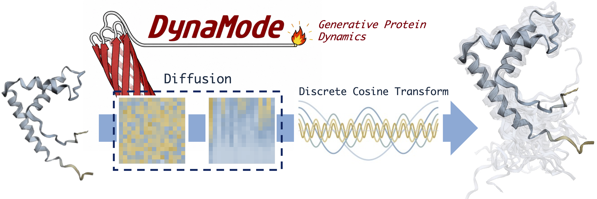

# DynaMode: Generative Protein Dynamics with Spectral Diffusion

[](https://openreview.net/forum?id=0Cy0I8B9O2) 

<p align="center">
  
</p>

Official implementation of [**DynaMode** (Spectral Diffusion for Protein Dynamics)](https://openreview.net/forum?id=0Cy0I8B9O2) accepted at ICML 2026 GenBio workshop. DynaMode is a  diffusion model trained on mdCATH to sample temporally coherent 256 frame (256ns) $C_\alpha$ monomer protein trajectories given an input structure and temperature. Diffusion in the DCT transformed spectral domain over the time domain leads to faster improved dynamics prediction over existing methods.

---

## Installation

From the repository root, create the conda environment:

```bash
conda env create -f dynamode.yaml
conda activate dynamode
```

The environment installs DynaMode in editable mode with evaluation extras (`-e .[eval]`).
Or just run `pip install -e`.

## Datasets

2. **mdCATH** — Use script `scripts/download_mdcath.py` to download from [HuggingFace](https://huggingface.co/datasets/compsciencelab/mdCATH) using `hugginface_hub`.
3. **ATLAS** - Use script `scripts/download_atlas.py` to download from [ATLAS](https://www.dsimb.inserm.fr/ATLAS/index.html) using their ftp server.

### OPTIONAL Prepare Zarr Dataset for Fast Training

Using zarr files can immensely increase both stability of training and speed by precomputing 
features into numerical arrays and not relying on maintaining open file streaming of .h5's or
temporary pdb file streams which can cause training.

```bash
python -m scripts.extract_mdcath_features_to_zarr.py --[args]
python -m scripts.extract_atlas_features_to_zarr.py --[args]
```

## Pre-trained Checkpoint

Available soon

## Hydra Configuration

DynaMode composes `run`, `core`, `data`, `representation`, `model`, `diffusion`, `sampling`, `training`, and `inference` groups from `configs/hydra/`. The default is the base CA experiment. The three YAML files in `configs/flat/` are retained only as historical references and are not runtime configuration inputs. Inspect the resolved configuration without running training:

```bash
python -m dynamode.train --cfg job
```

Select groups and override individual values with Hydra dot syntax:

```bash
torchrun --standalone --nproc_per_node=1 -m dynamode.train \
  experiment=base_ca \
  run.output_root=checkpoints \
  run.run_tag=no-shake \
  model.use_shake=false \
  data.mdcath_zarr_path=/path/to/mdcath.zarr
```

DynaMode creates one DDP-safe run directory on rank zero. Experiment and model handles come from the selected Hydra groups; the setup handle is derived from the coordinate representation and spectral configuration. `run.run_tag` is optional and appears after the setup handle:

```text
checkpoints/2026-08-20/
└── 14-32-18__base-ca__spec-conv-base__ca-disp-dct-k256-unit-var__no-shake__a1b2c3d4/
```

Without `run.run_tag`, the `__no-shake` segment is omitted. Each directory contains only three metadata files:

- `run_manifest.yaml`: identity, full composed config, overrides, minimal runtime-derived overlay, and Git/environment provenance.
- `model_spec.yaml`: configured model specification, then resolved classes, parameter counts, channels, spectral policies, noise settings, and hardware.
- `RUN.md`: short human-readable summary.

Set `core.checkpoint_dir=/exact/run/path core.resume_from_latest=true` to resume. DynaMode restores the recorded configuration from `run_manifest.yaml`, while `checkpoint_latest.pt` supplies model, optimizer, scheduler, and epoch state; both must exist. Operational overrides such as `core.epochs`, batch size, worker counts, or relocated data paths remain available; architecture and loss overrides are rejected unless `run.resume_allow_unsafe_overrides=true`.

## Inference

Use `dynamode.inference` to sample trajectories from a trained checkpoint for one PDB, a directory of PDBs, or a glob of PDB paths. Inference exports an aligned `.pdb` first frame and `.xtc` trajectory unless `inference.no_export=true`.

```bash
python -m dynamode.inference \
  inference.input=examples/target.pdb \
  inference.checkpoint_path=checkpoints/specconv/best_model.pt \
  inference.outdir=outputs/inference \
  inference.temperature=300 \
  inference.frames=256 \
  inference.num_ode_steps=50
```

You can also point inference at a training checkpoint directory. If `run_manifest.yaml` and `best_model.pt` are present, they are used automatically:

```bash
python -m dynamode.inference \
  inference.input=examples/target.pdb \
  inference.checkpoint_dir=checkpoints/specconv_run \
  inference.outdir=outputs/target_300K
```

## Training

Training is launched with `torchrun` because the trainer initializes distributed training even for a single GPU:

```bash
torchrun --standalone --nproc_per_node=1 -m dynamode.train \
  run.output_root=checkpoints \
  data.mdcath_zarr_path=/path/to/mdcath.zarr \
  data.split_ids_dir=/path/to/splits \
  data.freq_scales_path=/path/to/conditioned_freq_scales.pt \
  data.batch_size=32
```

For multi-GPU training, increase `--nproc_per_node`. To resume a run, set its concrete directory with `core.checkpoint_dir=/path/to/run` and set `core.resume_from_latest=true`. The existing run identity is recovered from `run_manifest.yaml`; no new timestamped directory is created. Training writes `checkpoint_latest.pt`, `best_model.pt`, periodic epoch checkpoints, and the metadata files above into the run directory.

## Citation

```bibtex
@inproceedings{phipps_2026,
  author    = {Hew Phipps, Matteo Cagiada, Santiago D. Villalba, Charlotte M. Deane},
  title     = {Spectral Diffusion for Protein Dynamics},
  booktitle = {GenBio Workshop},
  series    = {Proceedings of the International Conference on Machine Learning (ICML)},
  year      = {2026},
  url       = {https://openreview.net/forum?id=0Cy0I8B9O2}
}
```
